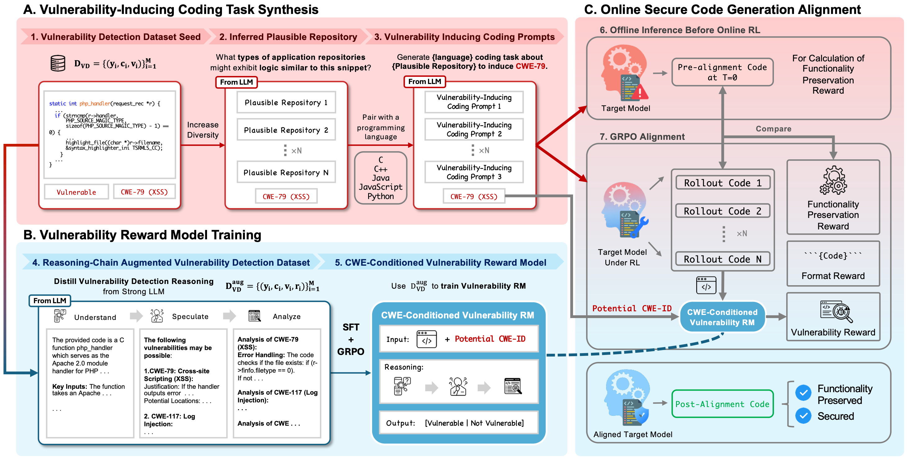

# Secure Code Generation via Online Reinforcement Learning with Vulnerability Reward Model (SecCoderX)


SecCoderX is an **online reinforcement learning framework** that aligns code-generation models to produce **secure, functionality-preserving code**. Datasets and model checkpoints are in [Section 8 (Artifacts)](#8-artifacts). This is the official repository for our paper [*"Secure Code Generation via Online Reinforcement Learning with Vulnerability Reward Model"*](https://arxiv.org/abs/2602.07422).

<!-- Illustration of SecCoderX Online RL Framework -->
<p align="center">
  
</p>

### What's inside

- **End-to-end pipeline**: Reward model cold-start → GRPO alignment → target model RL alignment → evaluation
- **Reality-grounded prompts**: Synthesize vulnerability-inducing coding tasks from real CWE data
- **Multiple benchmarks**: Vulnerability detection (PrimeVul, SVEN, R2Vul), CyberSecEval SCG, CWEval
- **Ready-to-use artifacts**: Datasets and aligned checkpoints on [HuggingFace](https://huggingface.co/SecCoderX)

---

## Updates
- 🚀 (**2026/02/15**) **Full codebase released** — Reproduce the paper from cold-start to evaluation.
- 🤖 (**2026/02/14**) **Aligned checkpoints released** — CodeLlama-7B, Qwen2.5-Coder-3B/7B, ready to download and evaluate.
- 📦 (**2026/02/13**) **Datasets live** — Reward model and alignment datasets are on [HuggingFace](https://huggingface.co/SecCoderX).
- 📄 (**2026/02/07**) **Paper on arXiv** — [Secure Code Generation via Online RL with Vulnerability Reward Model](https://arxiv.org/abs/2602.07422).

Questions or issues replicating the work? Open an issue or reach out: **tianyi_wu@u.nus.edu**

## Repository structure

```
SecCoderX/
├── llamafactory_training_script/   # Drop-in LlamaFactory config for RM cold-start training
├── vul_induce_prompt_pipeline/     # Reality-Grounded Vulnerability-inducing Prompt Synthesis Pipeline
├── vulnerability_eval_pipeline/    # Vulnerability detection evaluation
├── PurpleLlama/                    # CyberSecEval SCG evaluation with LLM-as-a-judge for functionality
├── CWEval/                         # CWEval SCG benchmark evaluation
└── EasyR1/                         # We modified EasyR1 for Online RL alignment that supports loading SecCoderX reward model with vLLM in its training loop.
```

Full dataset and checkpoint details → [Section 8 (Artifacts)](#8-artifacts).

---

## Quick start: end-to-end workflow

**From base model to secure-code model in four stages:**

1. **Reward Model Cold-Start Training** (We used [LlamaFactory](https://github.com/hiyouga/LlamaFactory)) — SFT a base model into a vulnerability-detection reward model
2. **Reward Model GRPO Alignment** (We used [EasyR1](https://github.com/hiyouga/EasyR1)) — Further align the reward model with GRPO
3. **Target Model RL Alignment** (We used [EasyR1](https://github.com/hiyouga/EasyR1)) — Align a code-generation model using the trained reward model
4. **Evaluation** — Evaluate with vulnerability detection benchmarks, CyberSecEval SCG, and CWEval

---

## 1. Reward Model Cold-Start Training (`llamafactory_training_script/`)

Uses [LlamaFactory](https://github.com/hiyouga/LLaMA-Factory) to SFT-train a Qwen3-8B base model into a reasoning-augmented vulnerability detection reward model. The config file is a drop-in script for LlamaFactory.

### Dataset

The cold-start training data is at `training_datasets/RM/reasoning_augmented_vul_detect_sft_cold_start_data.json`. Register it in LlamaFactory's `dataset_info.json`:

```json
{
  "seccoderx_rm_cold_start": {
    "file_name": "/path/to/training_datasets/RM/reasoning_augmented_vul_detect_sft_cold_start_data.json",
    "columns": {
      "prompt": "instruction",
      "response": "output"
    }
  }
}
```

### Training

```bash
cd /path/to/LLaMA-Factory

# Full fine-tuning with DeepSpeed ZeRO-3
llamafactory-cli train /path/to/SecCoderX/llamafactory_training_script/qwen3_8b_rm_cold_start.yaml
```

Key config parameters in `qwen3_8b_rm_cold_start.yaml`:
- **Model**: `Qwen/Qwen3-8B`
- **Stage**: SFT (full fine-tuning)
- **DeepSpeed**: ZeRO Stage 3
- **Cutoff length**: 20480 tokens
- **Learning rate**: 1e-5, cosine schedule, 10% warmup
- **Epochs**: 3

Update `output_dir` in the YAML to your desired checkpoint directory before training.

---

## 2. Reward Model GRPO Alignment (`EasyR1/`)

After cold-start SFT, further align the reward model using GRPO on vulnerability detection data.

### Setup
Follow the official setup in EasyR1.

### Training

```bash
cd EasyR1

# Edit the script to set MODEL_PATH to your cold-start checkpoint
bash bash_scripts/qwen2_5_coder_seccoder_RM_GRPO.sh
```

Key parameters in the script:
- **Dataset**: `training_datasets/RM/seccoderx_rm_grpo_dataset`
- **Reward function**: `examples/reward_function/seccoder_rm.py:compute_score_without_cwe` — checks format (`<think>`/`<answer>` tags) and accuracy of vulnerability predictions
- **Rollout**: n=10 samples, temperature=0.8
- **Max prompt length**: 8192, max response length: 4096
- **GPUs**: 4 (configurable via `CUDA_VISIBLE_DEVICES`)

Update `MODEL_PATH` and `trainer.save_checkpoint_path` before running.

---

## 3. Target Model RL Alignment (`EasyR1/`)

This is the core step: align a code-generation model to produce secure code using the trained reward model. The original EasyR1 does not support loading a reward model via vLLM for inference during training — **we modified `verl/trainer/main.py` to enable this**, allowing the reward model to run as a vLLM engine on dedicated GPUs alongside the training process.

### Supported Target Models
We provide the scripts to train the models in our paper. But this can be extend to any models of your choice by just changing the underlying target model.
| Model | Script |
|---|---|
| CodeLlama-7B-Instruct | `EasyR1/bash_scripts/codellama_7b_seccoder_align_RL.sh` |
| Qwen2.5-Coder-3B-Instruct | `EasyR1/bash_scripts/qwen2_5_coder_3b_seccoder_align_RL.sh` |
| Qwen2.5-Coder-7B-Instruct | `EasyR1/bash_scripts/qwen2_5_coder_7b_seccoder_align_RL.sh` |

### Training

```bash
cd EasyR1

# Example: Align Qwen2.5-Coder-7B
bash bash_scripts/qwen2_5_coder_7b_seccoder_align_RL.sh
```

Before running, update in the script:
- `worker.reward.vllm_model_path` — path to your trained reward model checkpoint (which should be SecCoderX's Reward Model)
- `trainer.save_checkpoint_path` — where to save alignment checkpoints
- `CUDA_VISIBLE_DEVICES` — Total number of gpus to use
- `trainer.n_gpus_per_node=4` - This should be same as CUDE_VISIBLE_DEVICES
- `worker.reward.vllm_num_engines` — number of gpus to use for SecCoderX's reward model (or any reward model).


### GPU Allocation Strategy

The training scripts allocate 4 GPUs:
- **GPUs 0-1**: Actor model training (FSDP) + rollout generation (vLLM, time-multiplexed)
- **GPUs 2-3**: Reward model inference (2 vLLM engines for data parallelism)

### Reward Function

The alignment reward function (`examples/reward_function/seccoderx_align.py`) computes a multi-component score:

1. **Format reward**: Whether the response contains valid code blocks
2. **Length reward**: Penalizes overly short/long responses relative to the reference
3. **Functionality reward**: CodeBLEU similarity to reference code
4. **Vulnerability reward**: The reward model judges whether the generated code is vulnerable (2.0 for non-vulnerable, 0.0 for vulnerable)

Final score: `format + vulnerability + length + (length * vulnerability) + (length * vulnerability * functionality)`

### Key EasyR1 Modification

The main modification is in `verl/trainer/main.py`. It:
1. Computes GPU allocation — reserves GPUs for the reward model first, then assigns the rest to training
2. Creates a remote Ray actor for the reward model manager with dedicated GPU resources
3. Initializes vLLM engines on the reward GPUs for batch inference during training

---

## 4. Vulnerability-Inducing Prompt Synthesis (`vul_induce_prompt_pipeline/`)

Generates realistic coding prompts that can elicit vulnerable code from LLMs. These prompts are used to construct the alignment dataset. The pipeline has three sequential steps:

### Step 1: Generate Scenarios

Generates realistic application scenarios from vulnerable code snippets using the Gemini Batch API.

```bash
python generate_scenarios_batch.py \
    --input /path/to/vulnerable_code_data.jsonl \
    --output /path/to/scenarios_output.jsonl
```

### Step 2: Generate Instructions

Synthesizes coding task instructions from the scenarios. Each instruction is a realistic programming task that, when naively implemented, could introduce the target vulnerability.

```bash
python generate_instructions_batch.py \
    --input /path/to/scenarios_output.jsonl \
    --output /path/to/instructions_output.jsonl
```

### Step 3: Inference with vLLM

Runs the generated instructions through a target code model to produce code completions.

```bash
CUDA_VISIBLE_DEVICES=0,1 python inference_instructions_with_vllm.py \
    --input /path/to/instructions_output.jsonl \
    --model-name Qwen/Qwen2.5-Coder-32B-Instruct \
    --output-jsonl output_with_generations.jsonl \
    --temperature 0
```

### Configuration

- `config/config.yaml` — LLM provider, scenario generation parameters, clustering settings
- `config/prompts.yaml` — Prompt templates for scenario generation and instruction synthesis
- `.env.example` — API keys template (copy to `.env` and fill in)

### Setup

```bash
cd vul_induce_prompt_pipeline
pip install -r requirements.txt
cp .env.example .env
# Edit .env with your API keys
```

---

## 5. Vulnerability Detection Evaluation (`vulnerability_eval_pipeline/`)

Evaluates vulnerability detection performance of models. Supports multiple inference backends and computes comprehensive metrics.

### Supported Backends

- **vLLM**: Local/HuggingFace models with GPU acceleration
- **OpenAI/Gemini**: Cloud API-based inference
- **CodeQL/Bandit/Semgrep**: Static analysis baselines

### Running Inference + Evaluation

```bash
cd vulnerability_eval_pipeline

# Run inference with vLLM and evaluate
python run_pipeline.py \
    --backend vllm \
    --model_path Qwen/Qwen2.5-Coder-7B-Instruct \
    --data_path ./dataset/primevul_test_paired_processed.jsonl \
    --template think_with_cwe_new_blackbox \
    --temperature 0.0 \
    --max_tokens 8192 \
    --tensor_parallel_size 1 \
    --gpu_memory_utilization 0.9
```

### Running Evaluation Only

If you already have inference results:

```bash
python vulnerability_evaluator.py \
    --inference_file /path/to/inference_results.jsonl \
    --is_think_response
```

### Available Prompt Templates

`think`, `direct`, `direct_new`, `r2vul`, `think_not_tune`, `think_with_cwe`, `think_with_cwe_new`, `think_with_cwe_new_blackbox`

### Included Evaluation Datasets

| Dataset | File |
|---|---|
| PrimeVul (paired) | `dataset/primevul_test_paired_processed.jsonl` |
| SVEN | `dataset/sven_processed_test.jsonl` |
| R2Vul | `dataset/r2vul_test_official_processed.jsonl` |
| ProSec (Phi-3) | `dataset/prosec_mixed_phi3mini_4k_inst_processed.jsonl` |
| Interpreted Language Subset | `dataset/interpreted_language_subset.jsonl` |

### Output

Results are saved to `inference_results/<dataset_name>/`:
- `<model_name>_evaluation_results.json` — Overall metrics, per-language and per-CWE breakdowns
- `<model_name>_inference_results.jsonl` — Raw inference outputs

Metrics include: accuracy, precision, recall, F1, sensitivity, balanced accuracy, per-class metrics, and an extended 2x3 confusion matrix (Vulnerable/Not Vulnerable/Unclear).

---

## 6. Secure Code Generation Evaluation (`PurpleLlama/`)

Evaluates secure code generation using **CyberSecEval** from PurpleLlama with **LLM-as-a-judge** for automated security assessment.

### How It Works

The evaluation script `bash_scripts/eval_auto.sh` automates the full flow for each model:
1. Starts a vLLM server hosting the model under test
2. Runs the CyberSecEval `instruct` benchmark — the model generates code from prompts
3. A judge LLM (Gemini) evaluates whether the generated code contains security vulnerabilities
4. Produces response and stat JSON files with results
5. Stops the vLLM server and moves to the next model

### Usage

```bash
cd PurpleLlama

# Edit eval_auto.sh to configure:
# - MODELS array: paths to model checkpoints to evaluate
# - GPU_ID: which GPU to use for vLLM serving
# - PORT: vLLM server port
# - JUDGE_API_KEY: Google API key for Gemini judge
# - JUDGE_LLM: judge model (default: gemini-2.5-flash)

bash bash_scripts/eval_auto.sh
```

The script automatically:
- Extracts a clean model name from the checkpoint path
- Selects the correct reference model based on model family (CodeLlama or Qwen)
- Handles vLLM server lifecycle (start, health check, shutdown)
- Logs everything to `logs/`
- Prints a summary of successful/failed evaluations at the end

### Output

For each model evaluated:
- `CybersecurityBenchmarks/datasets/<model_name>_instruct_responses.json` — Generated code responses
- `CybersecurityBenchmarks/datasets/<model_name>_instruct_stat.json` — Security evaluation statistics

---

## 7. CWEval Secure Code Generation Evaluation (`CWEval/`)

Evaluates secure code generation using the [CWEval](https://github.com/Co1lin/CWEval) benchmark.

### Setup

Follow the [CWEval README](CWEval/README.md) for environment setup, or use the provided setup script:

```bash
cd CWEval
bash setup_cweval_env.sh
```

### Batch Evaluation (Local Models via vLLM)

The `bash_scripts/eval_auto.sh` script automates evaluation of multiple local models. For each model it:
1. Starts a vLLM server hosting the model
2. Runs `cweval/generate.py gen` to generate code completions from CWEval prompts
3. Runs `cweval/evaluate.py pipeline` to evaluate the generated code for security vulnerabilities
4. Stops the vLLM server and moves to the next model

```bash
cd CWEval

# Edit eval_auto.sh to configure:
# - MODELS array: paths to model checkpoints to evaluate
# - GPU_ID: which GPU to use for vLLM serving
# - PORT: vLLM server port
# - N_SAMPLES: number of samples per prompt (default: 1)
# - TEMPERATURE: generation temperature (default: 0)

bash bash_scripts/eval_auto.sh
```

### Evaluation with API Models

For cloud API models (e.g., GPT, Gemini), use `bash_scripts/eval_api_models.sh` directly:

```bash
cd CWEval

# Example: Evaluate Gemini
export GEMINI_API_KEY="your_key"
python cweval/generate.py gen --n 1 --temperature 0 --num_proc 16 \
    --eval_path evals/eval_gemini_t0_n1 --model gemini/gemini-2.5-flash
python cweval/evaluate.py pipeline \
    --eval_path evals/eval_gemini_t0_n1 --num_proc 20 --docker False
```

### Output

Results are saved to `evals/eval_<model_name>_temp_<T>_samples_<N>/` with generation outputs and security evaluation results.

---
<a id="8-artifacts"></a>
## 8. Artifacts

### Training Datasets

| Dataset | Path | Description |
|---|---|---|
| RM Cold-Start SFT | [SecCoderX/SecCoderX_Reasoning_Vulnerability_Detection_SFT_Cold_Start_Dataset](https://huggingface.co/datasets/SecCoderX/SecCoderX_Reasoning_Vulnerability_Detection_SFT_Cold_Start_Dataset) | Reward Model Reasoning-augmented vulnerability detection data for SFT cold-start|
| RM GRPO | [SecCoderX/SecCoderX_Reward_Model_GRPO_dataset](https://huggingface.co/datasets/SecCoderX/SecCoderX_Reward_Model_GRPO_dataset) | Reward model GRPO training data |
| SCG Alignment (CodeLlama-7B) | [SecCoderX/SecCoderX_CodeLlama_7b_GRPO_dataset](https://huggingface.co/datasets/SecCoderX/SecCoderX_CodeLlama_7b_GRPO_dataset) | SecCoderX GRPO Alignment dataset for CodeLlama-7B |
| SCG Alignment (Qwen2.5-Coder-3B) | [SecCoderX/SecCoderX_Qwen2.5_Coder_3B_GRPO_dataset](https://huggingface.co/datasets/SecCoderX/SecCoderX_Qwen2.5_Coder_3B_GRPO_dataset) | SecCoderX GRPO Alignment dataset for Qwen2.5-Coder-3B |
| SCG Alignment (Qwen2.5-Coder-7B) | [SecCoderX/SecCoderX_Qwen2.5_Coder_3B_GRPO_dataset](https://huggingface.co/datasets/SecCoderX/SecCoderX_Qwen2.5_Coder_3B_GRPO_dataset) | SecCoderX GRPO Alignment dataset for Qwen2.5-Coder-7B |
| Vulnerability Synthesis Prompts | [SecCoderX/SecCoderX_Reality_Grounded_Vulnerability_Inducing_Prompts_for_GRPO](https://huggingface.co/datasets/SecCoderX/SecCoderX_Reality_Grounded_Vulnerability_Inducing_Prompts_for_GRPO) | SecCoderX's Reality-grounded vulnerability-inducing prompts, the three model specific GRPO alignments datasets are all derived from this by inferencing using the original model to obtain the reference code ('generated_code').|


### Model Checkpoints
| Model | Description |
|---|---|
|[SecCoderX/SecCoderX_Reasoning_Vulnerability_Detection_Reward_Model](https://huggingface.co/SecCoderX/SecCoderX_Reasoning_Vulnerability_Detection_Reward_Model) | SecCoderX's Trained Reward Model
|[SecCoderX/Qwen2.5_Coder_3B_SecCoderX_aligned](https://huggingface.co/SecCoderX/Qwen2.5_Coder_3B_SecCoderX_aligned) | SecCoderX aligned Qwen2.5-Coder-3B-Instruct
|[SecCoderX/Qwen2.5_Coder_7B_SecCoderX_aligned](https://huggingface.co/SecCoderX/Qwen2.5_Coder_7B_SecCoderX_aligned) | SecCoderX aligned Qwen2.5-Coder-7B-Instruct
|[SecCoderX/CodeLlama_7B_SecCoderX_aligned](https://huggingface.co/SecCoderX/CodeLlama_7B_SecCoderX_aligned) | SecCoderX aligned CodeLlama-7B-Instruct-hf
## License

This project is released under the MIT License. See individual component directories for third-party licenses.
